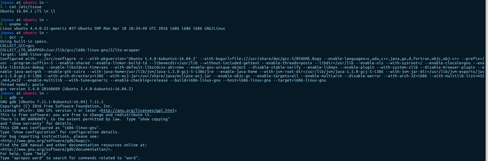
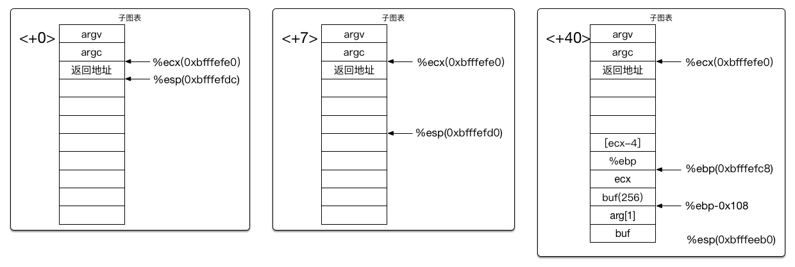

Title: 栈溢出漏洞之一
Date: 2016-07-08 09:59
Author: jmpews
Category: pwn
Tags: stackoverflow, pwn
Slug: stackoverflow_1

最近在学习安全研究, @张博 推荐 https://sploitfun.wordpress.com/2015/05/08/classic-stack-based-buffer-overflow/ 这个文章, 然后就做了一下复现, 但是发现和文章中有很大不同, 做一下记录.

本来这是一个很简明的栈溢出漏洞, 覆盖$esp的地址, 也就是返回地址, 让我们自己控制返回地址.


```
//vuln.c
#include <stdio.h>
#include <string.h>

int main(int argc, char* argv[]) {
        /* [1] */ char buf[256];
        /* [2] */ strcpy(buf,argv[1]);
        /* [3] */ printf("Input:%s\n",buf);
        return 0;
}
```

#### 编译环境:



#### 反汇编 `main` 函数


#### 运行栈状态



```
gdb-peda$ disassemble
Dump of assembler code for function main:
   0x0804843b <+0>:	  lea    ecx,[esp+0x4] // argc address
   0x0804843f <+4>:	  and    esp,0xfffffff0 // stack align
   0x08048442 <+7>:  	push   DWORD PTR [ecx-0x4] // return address
   0x08048445 <+10>:	push   ebp
   0x08048446 <+11>:	mov    ebp,esp
   0x08048448 <+13>:	push   ecx // save ecx
   0x08048449 <+14>:	sub    esp,0x104
   0x0804844f <+20>:	mov    eax,ecx
   0x08048451 <+22>:	mov    eax,DWORD PTR [eax+0x4] // argv address
   0x08048454 <+25>:	add    eax,0x4
   0x08048457 <+28>:	mov    eax,DWORD PTR [eax] // arg[1]
   0x08048459 <+30>:	sub    esp,0x8
   0x0804845c <+33>:	push   eax
   0x0804845d <+34>:	lea    eax,[ebp-0x108] // buf address
   0x08048463 <+40>:	push   eax
   0x08048464 <+41>:	call   0x8048310 <strcpy@plt>
   0x08048469 <+46>:	add    esp,0x10
   0x0804846c <+49>:	sub    esp,0x8
   0x0804846f <+52>:	lea    eax,[ebp-0x108]
   0x08048475 <+58>:	push   eax
   0x08048476 <+59>:	push   0x8048510
   0x0804847b <+64>:	call   0x8048300 <printf@plt>
   0x08048480 <+69>:	add    esp,0x10
   0x08048483 <+72>:	mov    eax,0x0
   0x08048488 <+77>:	mov    ecx,DWORD PTR [ebp-0x4] // restore ecx
   0x0804848b <+80>:	leave  
   0x0804848c <+81>:	lea    esp,[ecx-0x4] // !!! set esp again, keep ecx is right!
   0x0804848f <+84>:	ret    
End of assembler dump.
```

这里有几点需要说明的.

**对于第二个状态:**

<+7> 是进行内存栈对齐

**对于第三个状态:**

`[ecx-4]` 指向的就是 `Return Address`

`ecx` 入栈是为了之后恢复 `ecx`, 因为必须先知道 `ecx`, 才能通过 `[ecx-4]` 取得返回地址.

`arg[1]` 是如何压入栈的? 从 <+20> 开始, `[eax+0x4]` 也就是 `[esp+0x8]` 也就是 `arg`,从 <+25> 开始, `[eax]` 也就是 `[eax+0x4]` 也就是 `*(arg+1)` 也就是 `arg[1]`

所以**正常思路应该是覆盖区间 `[%ecx, $ebp-0x108]` 为 `'A'`, 也就是控制 `Return Address`. **

### 坑?
在 <+77> 恢复了 `ecx` 的值

** 重点在 <+81> 这里, 使用 `ecx-0x4` 恢复 `%esp` 的值, 而不是使用 `leave` 恢复 `%esp`**

更新: 发现好像只有在 `main` 函数里, 才会这么回复 `%esp`

所以 **如果我们想要继续正常思路, 我们必须保持 `ecx` 是不变的 **

### 那么如何覆盖 `Return Address` ?
#### 方法一:

采用正常思路, 然后保持 `ecx` 不变, 覆盖其他

#### 方法二:

重新设置 `ecx`, 控制 `ecx-0x4` 为我们想要的 `%esp`, 使该 `%esp` 指向的地址是我们的 目的地址. (也就是说多了一步.)
