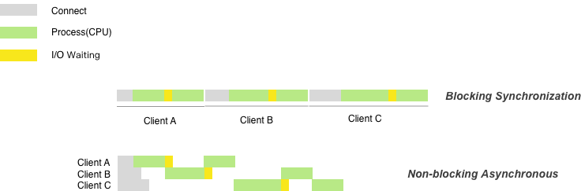

Title: 用图解释异步、非阻塞实质
Date: 2016-2-27 03:43
Author: jmpews
Category: Pattern
Tags: 异步, 非阻塞
Slug: understand-noblock-async

非阻塞异步到底是什么样的处理模型, 然后就画了一个图, 觉得应该挺简洁明了的.

在图中, 如果设置socket为非阻塞, 相当于节省了 `Connect` 时间, 当遇到 `tornado` 中的 `sleep` 需要挂起当前请求, 切换到其他处理请求, 节省 `I/O Waiting`.

总的来说服务端的非阻塞异步编程有以下几个点.

1. 服务端对于请求的处理, 必须要连续
2. 非阻塞是为避免I/O等待, 同时进行多个请求
3. 异步是为了当有事件响应时, 主动回调事件处理

在tornado中实现了异步的sleep, 设置好超时, 加入IOLoop循环中, yield切换协程, 然后IOLoop不断循环检测是否超时, 当检测到超时, 触发yield, 回到当时上下文。
