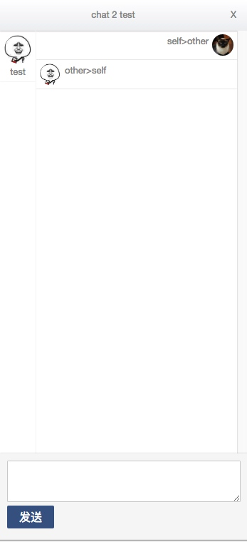
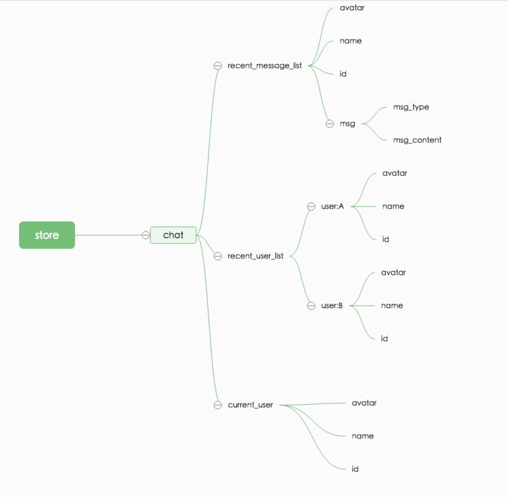

## 基于react和websocket的实时通讯实践
### 简介:

前端用的react+redux作为解决方案,配合websocket实现，具有历史消息记录、未读消息、最近联系等功能.

### react+redux简介
react, 虚拟dom, 组件化重用, **更多事对view的解决方案**, 对于数据组件的通信, 就需要借助redux等.

redux, 组件间的数据通信(可以想象成把后端的设计模式, 搬到前端来了)

### redux实践

redux里有几个概念比较重要. 1. Actions 2. Reducers 3. Store

#### Store

> store是一个单一对象
> * 管理应用的 state
> * 通过 store.getState() 可以获取 state
> * 通过 store.dispatch(action) 来触发 state 更新
> * 通过 store.subscribe(listener) 来注册 state 变化监听器
> * 通过 createStore(reducer, [initialState]) 创建

Store 有些类似后端里的Data-Model(只有一棵树), 这个必须要提前设计好的.

只能读，不可以对原store修改, 只能修改并返回store的副本. 否则会影响view的更新.


#### Actions

可以认为是约定好的API格式, 包含action.type, 以及该action需要携带的数据. 通过发送不同的action, 来实现对store的修改.

#### Reducers

既然Actions是API, 那API的具体实现可以认为是Reducers, 接收到action后, 需要判断具体是什么类型的action, 根据action.type以及携带数据对store(副本)具体修改

store修改后, 触发特定分支的state发生改变, 进而触发react的重新render

### react+redux+websocket具体解决方案

#### [react-redux-websocket](../../frontend/static/templates/react/chat)

```
├── dist
├── index.html
├── npm-debug.log
├── package.json
├── server.js
├── src
│   ├── actions
│   │   └── index.js
│   ├── api
│   │   └── chat.js
│   ├── components
│   │   ├── messageItem.js
│   │   ├── messageList.js
│   │   ├── userItem.js
│   │   └── userList.js
│   ├── constants
│   │   └── ActionTypes.js
│   ├── containers
│   │   └── chatContainer.js
│   ├── globalStore.js
│   ├── index.js
│   ├── reducers
│   │   ├── chat.js
│   │   └── index.js
│   └── utils.js
└── webpack.config.js

9 directories, 18 files
```

### tornado-websocket后端具体

#### [tornado-websocket](../../app/user/user.py#L182)
