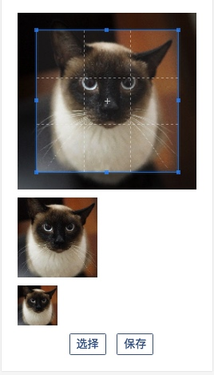

## 头像裁剪上传解决方案

### 简介:


采用`cropper.min.js`, 进行图片的裁剪

### html部分

```
<div class="user-avatar-edit">
	<div class="select-avatar">
		
	</div>
	<ul class="photo-container">
		<li class="avatar-preview col-2"></li>
		<li class="avatar-preview col-1"></li>
	</ul>
	<!-- custom upload button -->
	<button class="btn btn-outline-primary btn-sm select-avatar">
		<input type="file" class="file-input" id="avatar" name="avatar" onchange="change_image_preview()">选择
	</button>
	<button type="submit" class="btn btn-outline-primary btn-sm upload-avatar">保存</button>
</div>
```

### js部分

```
// 设置cropper插件
$('#avatar-cropper').cropper({
    viewMode: 2,
    aspectRatio: 1 / 1,
    checkImageOrigin: true,
    preview: '.avatar-preview',
});

// 图片预览
function change_image_preview() {
    $inputFileElm = $(this);
    var avatar_cropper = document.getElementById("avatar-cropper");
    var avatar_file = document.getElementById("avatar-file");
    var ext = avatar_file.value.substring(avatar_file.value.lastIndexOf(".") + 1).toLowerCase();
    // gif在IE浏览器暂时无法显示
    if (ext != 'png' && ext != 'jpg' && ext != 'jpeg') {
        alert("文件必须为图片！");
        return;
    }
    if (avatar_file.size > 1024 * 3000) {
        alert("上传图片不要超过3000KB");
        return;
    }
    // IE浏览器
    if (document.all) {
        avatar_file.select();
        var reallocalpath = document.selection.createRange().text;
        var ie6 = /msie 6/i.test(navigator.userAgent);
        // IE6浏览器设置img的src为本地路径可以直接显示图片
        if (ie6) avatar_cropper.src = reallocalpath;
        else {
            // 非IE6版本的IE由于安全问题直接设置img的src无法显示本地图片，但是可以通过滤镜来实现
            avatar_cropper.style.filter = "progid:DXImageTransform.Microsoft.AlphaImageLoader(sizingMethod='image',src=\"" + reallocalpath + "\")";
            // 设置img的src为base64编码的透明图片 取消显示浏览器默认图片
            avatar_cropper.src = 'data:image/gif;base64,R0lGODlhAQABAIAAAP///wAAACH5BAEAAAAALAAAAAABAAEAAAICRAEAOw==';
        }
    }
    else {
        var f = avatar_file.files[0];
        var reader = new FileReader();
        reader.readAsDataURL(f);
        reader.onload = function (e) {
            avatar_cropper.src = e.target.result;
            // 重新载入croppper
            $(avatar_cropper).cropper('reset').cropper('replace', e.target.result);
        }
    }
    $inputFileElm.val("");
}


// 上传头像
$('.upload-avatar').on('click', function (e) {
    e.preventDefault();
    var avatar64 = $('#avatar-cropper').cropper('getCroppedCanvas', {width: 200, height: 200}).toDataURL();
    $.ajax({
        type: 'post',
        dataType: 'json',
        url: '/useropt',
        data: JSON.stringify({'opt': 'update-avatar', 'data': {'avatar': avatar64.split(',')[1]}}),
        success: function (result, status) {
            if (result.errorcode == 0) {
                $.notify('头像更换成功');
                window.location.reload();
            }
            else if (result.errorcode == 1) {
                alert(result.txt);
            }
        }
    });
});
```

### 服务端解决方案

```
import base64
avatar = base64.b64decode(data['avatar'])
user = self.current_user
avatar_file_name = user.username + '.png'
avatar_file = open(config.avatar_upload_path + avatar_file_name, 'wb')
avatar_file.write(avatar)
user.avatar = avatar_file_name
user.save()
self.write(json_result(0, 'success'))
```

